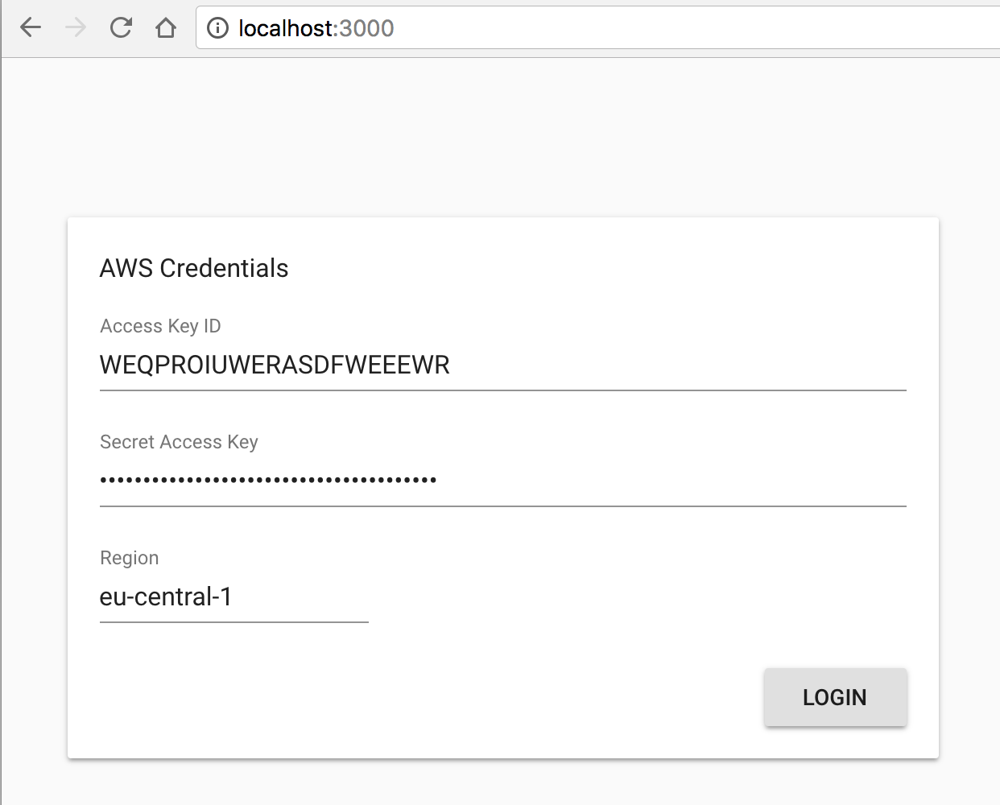
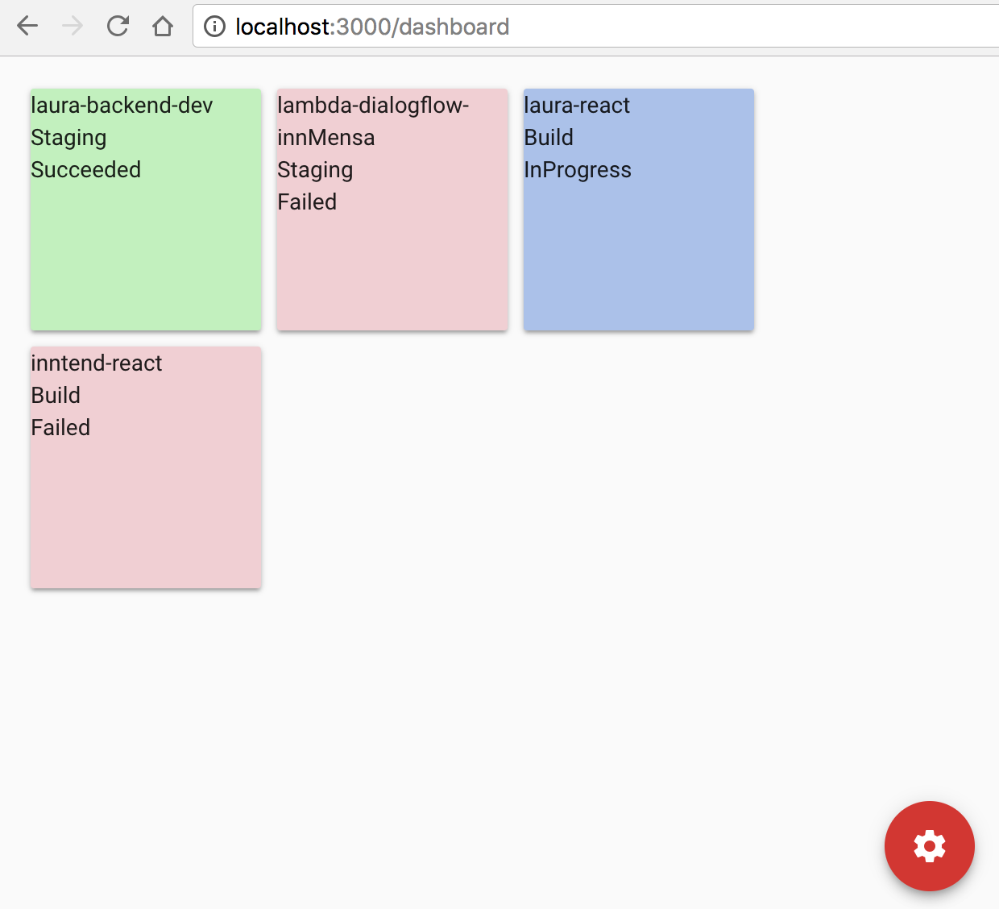

# A simple dashboard for monitoring your aws codepipelines




## How to use

Download or clone this repo

```bash
git clone https://github.com/innFactory/aws-codepipeline-dashboard
cd create-react-app-material-typescript-redux
```

Install it and run:

```bash
npm i
npm start
```

Got to http://localhost:3000/

## Todo List
- [x] Show states of codepipelines
- [x] Refresh codepipelines every 8-20 seconds
- [ ] Add pretty animations for each state
- [ ] Support for custom grid sizes
- [ ] Add theming

## Contributors

* [Anton Spöck](https://github.com/spoeck)

Powered by [innFactory](https://innfactory.de/)
